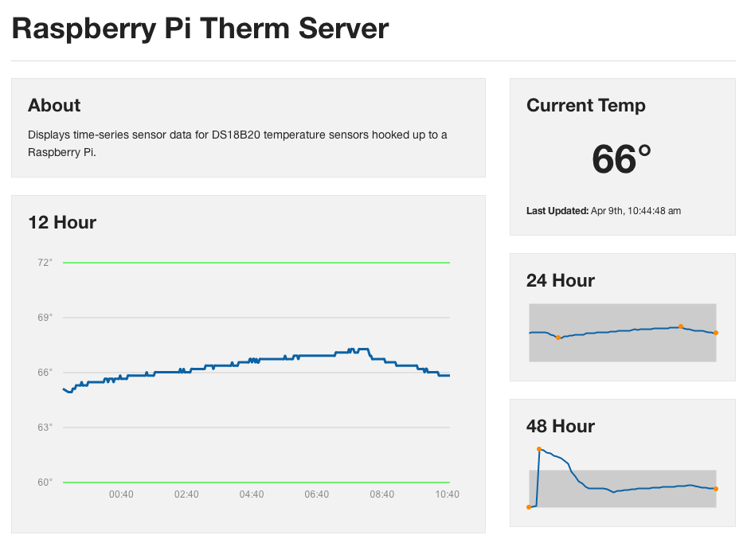
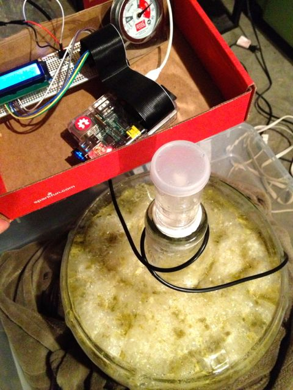

PiThermServer
=============

Simple NodeJS server for the DS18B20 digital temperature sensor on the Raspberry Pi.

Description
-----------
A few lines of code to show my implementation of a NodeJS server for the DS18B20 GPIO temperature sensor on the Raspberry Pi. The sensor is accessed using the w1-gpio and w1-therm kernel modules in the Raspbian distro. The server parses data from the sensor and returns the temperature and a Unix time-stamp in JSON format. A simple front-end is included and served usig node-static, which performs ajax calls to the server and plots temperature in real time using the Morris.js and jQuery Sparkline JavaScript libraries.

Files
-----
* server.js - NodeJS server, returns temperature as JSON and serves static web assets
* sensor.js - NodeJS script for polling the sensor and storing data in a Redis DB
* web/ - static web assets for displaying temperature dashboard
* scripts/load_gpio.sh - bash commands to load kernel modules
* scripts/ - various scripts for starting sensor/server on boot and displaying temperature on an LCD screen

Usage
-----
* With sensor attached load kernel modules: sudo load_gpio.sh
* Start sensor polling: node sensor.js (or via init.d)
* Start server: node server.js (or via init.d)

References
----------
http://tomholderness.wordpress.com/2013/01/03/raspberry-pi-temperature-server/
http://www.cl.cam.ac.uk/freshers/raspberrypi/tutorials/temperature/

Screenshots/Images
------------------

